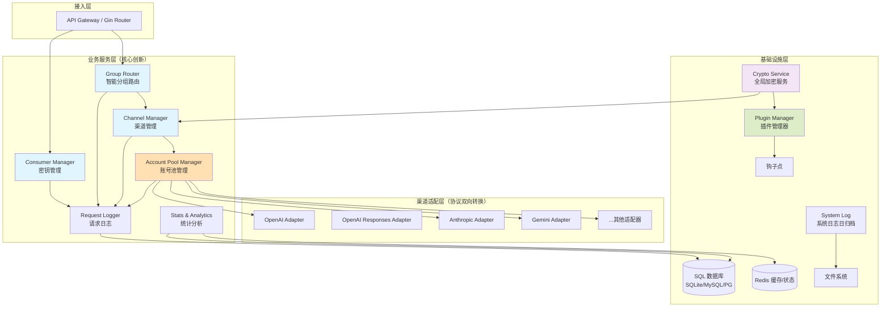
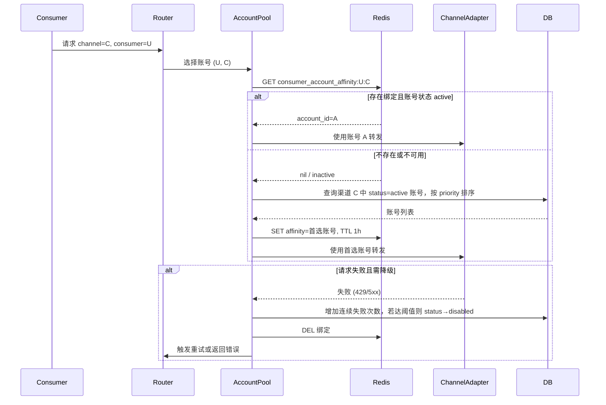
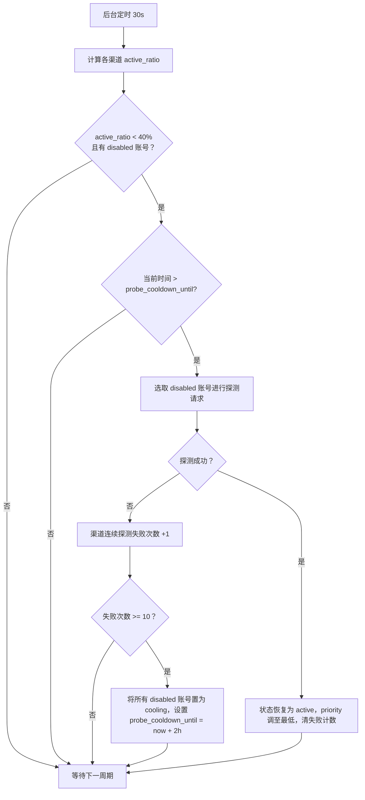
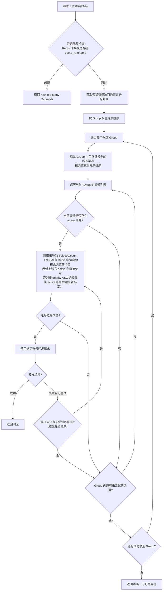

# 高性能多租户AI API聚合代理系统 - 完整设计方案（图文版）

## 1. 项目愿景与目标

开发一个**企业级、高性能、多租户**的 AI API 统一代理系统。

- **消费方密钥独立管理**：为每个用户或应用生成独立的 API Key，支持命名、配额和使用统计。
    
- **精准模型智能路由**：根据请求的模型名，在有权分组中按权重和模型存在性选择渠道，避免调用失败。
    
- **统一 OpenAI 协议**：所有入站请求和出站响应均采用 OpenAI Chat Completions 格式，适配绝大多数下游客户端。渠道适配器负责双向协议转换（OpenAI ↔ 上游格式），对密钥完全透明。
    
- **上游账号全生命周期管理**：单渠道多账号，优先级、用户亲和（粘性）、故障停用、按需探测恢复与冷却策略，最大化利用缓存，降低成本。
    
- **高效渠道配置**：模型自动发现、批量映射，提升运维效率。
    
- **多维度统计与日志**：系统运行日志按日归档；请求日志记录完整调用链路（含故障转移链）。
    
- **存储自由**：默认 SQLite 开箱即用，可选 MySQL/PostgreSQL；Redis 用于高性能状态缓存。
    
- **原生多语言**：前后端中英文国际化，语言文件外置。
    
- **插件化架构**：Sidecar 插件钩子，保障核心稳定与无限扩展。
    
- **模块化设计**：接口驱动、依赖注入，易于测试和替换。
    
- **全局加密与安全配置**：系统级 AES-256-GCM 加密密钥，`.env` 环境变量管理敏感信息，保障生产安全。

## 2. 系统总体架构



### 2.1 分层架构图

### 2.2 与 GPT-Load 的关系

- **复用**：代理引擎（零拷贝流式）、连接池、部分渠道适配器、中间件基础。
    
- **重写**：密钥体系、路由逻辑、账号池管理、统计日志、多语言、插件机制、全局加密与环境变量配置。
    

### 2.3 技术栈

- 后端：Go + Gin + uber/dig + GORM + go-redis + zap
    
- 前端：Vue 3 + TypeScript + Naive UI + ECharts + vue-i18n
    
- 数据库：SQLite（默认）、MySQL 8.0、PostgreSQL 15+
    
- 缓存：Redis 7.0（可选，可降级）
    
- 部署：Docker Compose、Kubernetes、二进制单文件
    
- 加密：AES-256-GCM，系统级全局密钥

## 3. 核心模块详细设计

### 3.1 密钥管理模块

**数据模型**

```sql
consumers (id, name, api_key_hash, status, created_at)
key_groups (id, name, description)
key_group_members (key_id, group_id, quota_rpm, quota_tpm)
```

**功能**：生成/吊销 Key，自定义名称；实时统计（Redis 计数→定时入库）；通过密钥分组控制可访问的渠道分组。

### 3.2 渠道与账号管理模块

#### 3.2.1 渠道定义

```sql
channels (id, name, type, base_url, status, extra_config)
```

`type` 枚举值：

| 值 | 说明 | 上游协议 |
|---|------|---------|
| `openai` | OpenAI Chat Completions（也兼容 Azure、DeepSeek、Moonshot、Groq 等第三方） | `/v1/chat/completions` |
| `openai-response` | OpenAI Responses API（2025 新格式） | `/v1/responses` |
| `anthropic` | Anthropic Claude Messages API | `/v1/messages` |
| `gemini` | Google Gemini API | `generateContent` |

所有适配器统一实现**双向协议转换**：入站 OpenAI 格式 → 上游格式，上游格式 → 出站 OpenAI 格式。

```sql
channel_models (id, channel_id, upstream_model_name, display_model_name, max_tpm, max_rpm)
channel_accounts (
  id, channel_id, api_key_encrypted,
  priority INT,       -- 越小越优先
  status ENUM('active','disabled','cooling'),
  consecutive_failures INT,
  last_failed_at,
  probe_cooldown_until,
  created_at
)
```

**模型自动发现**：适配器接口增加 `FetchModels()`，管理员点击按钮拉取上游模型，勾选后自定义别名。

- `api_key_encrypted`：使用全局加密密钥 AES-256-GCM 加密后以 Base64 存储。
    
- 解密：通过 `crypto` 工具包提供的 `Decrypt()` 方法在转发时临时解密，支持短时缓存。
    

#### 3.2.3 请求时账号选择（粘性策略）



**渠道级故障转移**：当某渠道 active 账号数为 0，该渠道立即标记不可用，路由选择同分组内下一渠道。

#### 3.2.4 按需探测恢复流程



### 3.3 分组与智能路由模块（Group Router）

#### 3.3.1 核心概念

- **Channel Group**：一组渠道的集合，可配置权重。例如"GPT-4 高速组"、"GPT-4 廉价组"。
    
    - `id`， `name`， `weight`
        
    - 关联：`group_channel_mapping` (group_id, channel_id, weight)
        
- **Key Group 与 Channel Group 的绑定**：定义哪些用户能使用哪些渠道分组。
    
    - `key_group_id`， `channel_group_id`
        

#### 3.3.2 智能路由流程



路由策略采用**严格分层、确定性优先**的原则：**渠道权重 → 渠道内账号优先级与可用性 → 渠道级故障转移**。不再使用随机选择。

具体处理步骤如下：

0. **密钥配额检查**  
   在路由开始前，先查询 Redis 中该密钥的当前分钟/日计数器。若已超过 `key_group_members` 中为该密钥分组配置的 `quota_rpm` 或 `quota_tpm`，直接返回 `429 Too Many Requests`，不再进行后续路由和账号选择。此步骤在认证完成后、分组路由之前执行，避免超配额密钥消耗上游资源。

1. **获取密钥权限分组**  
    根据 Consumer 所属的 Key Group，获得允许访问的 Channel Group 列表，按 Group 权重大小降序排序。
    
2. **模型存在性过滤**  
    对于每个 Channel Group，查询该 Group 内所有渠道（通过 `channel_group_mappings` 关联）的 `channel_models` 表，判断是否存在 `display_model_name` 等于请求的模型名且状态为 `enabled` 的记录。  
    _只要 Group 内至少有一个渠道包含该模型，该 Group 就视为候选。_
    
3. **按 Group 权重顺序尝试**  
    从权重最高的候选 Group 开始，在 Group 内部按照**渠道权重降序**依次尝试每个渠道。  
    _若多个渠道权重相同，默认按渠道 ID 升序（确定性选择），后续可扩展为加权轮询或最少连接数策略。_
    
4. **渠道可用性检查**  
    对当前渠道，检查其是否具备 `active` 账号（通过 `account_pool` 模块判断）。若无，则跳过该渠道，尝试同 Group 内的下一个渠道。
    
5. **账号选择（含粘性复用）**  
    一旦找到可用的渠道，立即调用账号池的 `SelectAccount(consumerID, channelID)` 方法。账号池内部逻辑如下：
    
    - **优先检查粘性绑定**：查询 Redis 中是否存在 `consumer_account_affinity:{key_id}:{channel_id}`。若存在且指向的账号状态仍为 `active`，则**直接复用该账号**，无需重新按优先级选择。
        
    - **绑定失效时重新选择**：若绑定不存在或账号已不可用，则从该渠道当前所有 `active` 账号中按 `priority ASC`（优先级值越小越优先）选择最佳账号，并在 Redis 中建立新绑定（TTL 默认 1 小时）。
        
    - **同渠道内账号重试**：若选定账号在转发后失败（如返回 429/5xx），账号池将该账号标记为禁用、清除绑定，然后**按优先级顺序**尝试该渠道的下一个 `active` 账号。此过程重复进行，直到找到一个可用账号并成功转发。
        
    - **渠道账号耗尽**：若该渠道所有 `active` 账号均已尝试且全部失败，则返回错误给 Group Router。
        
6. **渠道级故障转移**  
    当账号池返回"渠道账号耗尽"错误时，Group Router **按渠道权重顺序**取下一个候选渠道，重复步骤 4-5。所有尝试过的渠道和账号将被记录在 `retry_chain` 中。  
    若整个 Group 内所有渠道均失败，则尝试下一个权重的候选 Group。
    
7. **全部耗尽**  
    所有候选 Group 均无可用渠道或账号时，返回错误响应，明确提示"模型无可用渠道"。`retry_chain` 将完整记录每一次失败的尝试链路，便于排查。
    

**核心行为总结**：

- 用户第一次请求某模型时，系统按渠道权重和账号优先级选择最优路径，并建立粘性绑定。
    
- 后续相同用户请求相同模型时，**只要绑定的账号仍然可用，就会一直使用它**，最大化利用上游缓存。
    
- 当该账号不可用时，在同渠道内按优先级依次降级到下一个账号。
    
- 当该渠道所有账号都不可用时，才顺延到下一个权重的渠道。
    
- 整个过程完全确定性，相同条件下总是命中同一路径，行为可预测。
    

#### 3.3.3 设计优势

- **完全确定性**：请求在相同条件下总是命中同一渠道和账号，行为可预测，便于排查问题。
    
- **资源利用充分**：权重高的渠道优先服务，账号内部按优先级使用，充分利用优质上游。
    
- **无缝故障转移**：渠道或账号失效时自动降级，无需人工干预，且保留完整重试链。
    

### 3.4 统计分析模块

**数据流**：

1. 请求结束时异步写入 `request_logs` 表。
    
2. 实时计数器利用 Redis（按日/小时）。
    
3. 定时任务（每小时/日）聚合到 `*_daily_stats` 表，支持高效查询。
    

**统计表**：

```sql
system_daily_stats (date, total_requests, success, fail, avg_latency, total_tokens, ...)
consumer_daily_stats (id, date, key_id, model_name,  total_requests, ...)
channel_daily_stats (id, date, channel_id, model_name,  total_requests, active_accounts, ...)
```

**展示维度**：

- **系统总览**：指标卡片、请求趋势图、模型/渠道分布图。
    
- **用户分析**：用量趋势、模型偏好、失败分布、峰值热力图。
    
- **渠道分析**：用量、分模型请求数、账号负载详情（辅助权重调整）。

### 3.5 日志管理

#### 3.5.1 系统运行日志

- 基于 `zap` 实现结构化日志。
    
- 按日滚动存储：`logs/{year}/{month}/{day}.log`
    
- 配置保留天数（如 365），过期自动清理目录。
    
- 同时输出控制台。

#### 3.5.2 渠道使用日志（请求追踪）

**表结构**：

```sql
request_logs (
    id BIGINT PRIMARY KEY,
    timestamp DATETIME NOT NULL,
    key_id INT,
    model_name VARCHAR(100),
    channel_id INT,
    account_id INT,
    retry_chain JSON,  -- 故障转移记录
    stream BOOLEAN,
    prompt_tokens INT,
    completion_tokens INT,
    status_code INT,
    error_msg TEXT,
    latency_ms INT,
    request_meta JSON,  -- 可选，可脱敏
    response_meta JSON, -- 可选
    INDEX idx_consumer_time (key_id, timestamp),
    INDEX idx_channel_time (channel_id, timestamp),
    INDEX idx_model_time (model_name, timestamp)
);
```

**retry_chain 示例**：

```json
[
  {"channel_id":3, "account_id":12, "error":"429"},
  {"channel_id":3, "account_id":15, "error":"timeout"},
  {"channel_id":7, "account_id":28, "result":"success"}
]
```

**WebUI 特性**：强大筛选器（按用户、模型、渠道、账号、状态、时间），列表展开查看重试详情，支持导出 CSV。

### 3.6 国际化 (i18n)

- 前端：`vue-i18n`，语言文件 `web/locales/zh-CN.json`, `en-US.json`。
    
- 后端：通过 `Accept-Language` 头返回对应语言的错误信息（初期可仅前端）。
    
- 切换按钮持久化到 localStorage。

### 3.7 插件系统

**插件模型**：Sidecar 进程，通过 HTTP/gRPC 与主系统通信。  
**钩子点定义**：

- 请求前预处理（修改或拦截）
    
- 响应后处理（内容过滤、格式转换）
    
- 账号选择决策（替换默认亲和策略）
    
- 计费/统计钩子

**管理界面**：上传插件、启用/禁用、配置推送。

**安全认证**：插件 Token 使用全局加密密钥加密存储于数据库，启动时通过环境变量注入。

### 3.8 模块化架构

**代码布局**：

```text
cmd/server/         # 入口
internal/
  consumer/         # 密钥管理
  channel/          # 渠道管理
  account/          # 账号池
  group/            # 分组路由
  proxy/            # 代理引擎
  log/              # 日志系统
  stats/            # 统计分析
  i18n/             # 国际化
  plugin/           # 插件管理
  crypto/           # 全局加密服务
  storage/          # 存储抽象（SQLite/MySQL/PostgreSQL 实现）
pkg/
  adapter/          # 渠道适配器接口及实现
    openai/         # OpenAI Chat Completions 适配器
    openai_responses/ # OpenAI Responses API 适配器
    anthropic/      # Anthropic Messages API 适配器
    gemini/         # Google Gemini 适配器
  sdk/              # 插件 SDK（可独立发布）
  middleware/        # Gin 中间件
web/                # 前端源码
locales/            # 多语言文件
```

**接口驱动**：

- `Storage` 接口统一数据库操作
    
- `AccountSelector` 接口定义账号选择
    
- `RouteStrategy` 接口定义路由策略
    
- `ChannelAdapter` 接口定义渠道适配（含双向协议转换方法）

所有 `ChannelAdapter` 实现必须提供：
- `ConvertRequest(openaiReq) → upstreamReq`：入站 OpenAI 格式转上游格式
- `ConvertResponse(upstreamResp) → openaiResp`：上游格式转出站 OpenAI 格式
- `FetchModels(baseURL, apiKey) → []ModelInfo`：获取上游可用模型列表

依赖注入（`uber/dig`）组装各模块。

## 4. 全局加密与环境变量配置

### 4.1 全局加密密钥

#### 4.1.1 用途

一个系统级别的对称加密密钥（AES-256-GCM），用于加密所有需要持久化存储的敏感数据：

- 上游渠道的**账号 API Key**（`channel_accounts.api_key_encrypted`）
    
- 可选的密钥密钥体（若我们不只存哈希）
    
- 插件间通信的内部 Token
    
- 未来的配置备份加密等

#### 4.1.2 生成与部署

**部署时自动生成**，类似于 GPT-Load：

- 首次启动时，若 `.env` 中或 `config.yaml` 中未找到 `SECRET_KEY`，则使用加密安全随机数生成一个**32 字节**的密钥，Base64 编码后写入 `.env` 文件并加载。
    
- 提示用户妥善保管此密钥，丢失将导致已加密数据无法解密。

**代码示例 (Go)**：

```go
if os.Getenv("SECRET_KEY") == "" {
    key := make([]byte, 32)
    if _, err := rand.Read(key); err != nil {
        log.Fatal("failed to generate secret key")
    }
    encoded := base64.StdEncoding.EncodeToString(key)
    // 写入 .env 文件或输出到控制台，要求用户保存
    fmt.Printf("Generated SECRET_KEY: %s\n", encoded)
    os.Setenv("SECRET_KEY", encoded)
}
```

#### 4.1.3 使用方式

引入一个 `crypto` 工具包，内部封装 `Encrypt(plaintext string) ([]byte, error)` 和 `Decrypt(ciphertext []byte) (string, error)`，所有模块统一调用。

**对现有模块的影响**：

- **账号管理**：`channel_accounts` 表的 `api_key_encrypted` 字段存储密文，创建/修改账号时调用加密接口，转发时解密。
    
- **密钥模块**：若选择存储完整 Key（而非仅哈希），则同样加密存储。
    
- **插件鉴权**：插件注册时分配的 Token 可加密后存储，主系统解密后核对。
    

### 4.2 环境变量配置 (.env)

#### 4.2.1 为什么引入 .env

- 符合 12-Factor App 理念，容器化和云原生部署的标配。
    
- 敏感信息（数据库密码、Secret Key、各种客户端密钥）不应存入 `config.yaml` 或代码库。
    
- 与 Docker/K8s 环境变量注入无缝对接。
    

#### 4.2.2 .env 文件覆盖的配置项

我们定义三类配置，优先级从高到低：

1. **环境变量**（覆盖一切）
    
2. **.env 文件**（如果环境变量未设置）
    
3. **config.yaml**（基础配置）
    

系统启动时，统一加载：先用 Viper 读取 `config.yaml`，再读取 `.env`（可选），最后检查进程环境变量，后面的覆盖前面的。

**示例 `.env` 文件结构**：

```text
# 全局加密密钥（必需）
SECRET_KEY=base64encodedkey...

# 数据库（当使用 SQLite 时不需要）
DB_TYPE=postgres
DB_HOST=127.0.0.1
DB_PORT=5432
DB_USER=gateway
DB_PASSWORD=supersecret
DB_NAME=ai_gateway

# Redis（可选）
REDIS_ENABLED=true
REDIS_ADDR=127.0.0.1:6379
REDIS_PASSWORD=

# 服务端口
PORT=8080

# 日志保留天数
LOG_RETENTION_DAYS=365

# 默认语言
DEFAULT_LANGUAGE=zh-CN

# 账号池配置
ACCOUNT_AFFINITY_TTL=3600
ACCOUNT_FAILURE_THRESHOLD=5
ACCOUNT_PROBE_INTERVAL=30
ACCOUNT_PROBE_ACTIVE_RATIO=0.4
ACCOUNT_PROBE_MAX_FAILURES=10
ACCOUNT_PROBE_COOLDOWN=7200
```

这些环境变量会绑定到我们 `config` 包的结构体字段上，例如：

```go
type Config struct {
    SecretKey string `mapstructure:"secret_key"`
    DB        DBConfig
    Redis     RedisConfig
    AccountManager AccountManagerConfig
    Log       LogConfig
    // ...
}
```

#### 4.2.3 与 config.yaml 的分工

- `config.yaml` 仍然保留所有非敏感的默认配置和结构项（如账号池探测阈值、重试次数、插件超时等），方便版本控制和快速理解。
    
- `.env` 主要用于**部署时覆盖敏感值或环境差异值**，如数据库连接、密钥等。

#### 4.2.4 安全提醒

- `.env` 文件**绝不**提交到 Git，应加入 `.gitignore`。
    
- Docker 部署时，可以通过 `env_file` 或直接传递环境变量，不挂载实体 `.env` 文件。
    
- 日志中不得输出 `SECRET_KEY` 或数据库密码。

## 5. 数据库设计精简版

关键表汇总（详细字段见各模块设计）：

```sql
-- 用户体系
consumers (id, name, api_key_hash, status, created_at, updated_at)
key_groups (id, name, description)
key_group_members (key_id, group_id, quota_rpm, quota_tpm)

-- 渠道体系
channels (id, name, type, base_url, status, extra_config)
channel_models (id, channel_id, upstream_model_name, display_model_name, max_tpm, max_rpm)
channel_accounts (id, channel_id, api_key_encrypted, priority, status, consecutive_failures, last_failed_at, probe_cooldown_until, created_at)

-- 分组关联
channel_groups (id, name, weight)
channel_group_mappings (group_id, channel_id, weight)
key_group_channel_groups (key_group_id, channel_group_id)

-- 请求日志
request_logs (id, timestamp, key_id, model_name, channel_id, account_id, retry_chain JSON, stream, prompt_tokens, completion_tokens, status_code, error_msg, latency_ms, request_meta JSON, response_meta JSON)

-- 统计表
system_daily_stats (date, total_requests, success_requests, fail_requests, avg_latency_ms, total_tokens, unique_consumers, unique_channels)
consumer_daily_stats (id, date, key_id, model_name, total_requests, success_requests, fail_requests, avg_latency_ms, total_tokens)
channel_daily_stats (id, date, channel_id, model_name, total_requests, success_requests, fail_requests, avg_latency_ms, total_tokens, active_accounts)
```

## 6. Web 管理界面功能清单

- **仪表盘**：核心指标卡片，近 24 小时趋势图，模型与渠道 Top 排行。
    
- **密钥**：列表、新建/编辑、生成 API Key、配额分组设置。
    
- **渠道**：列表、新建（类型、URL）、**模型自动发现**、模型映射与限制。
    
- **账号**：隶属于渠道，列表展示状态、优先级拖拽排序、手动禁用/启用、失败历史。
    
- **分组**：渠道分组（含权重）、密钥分组，以及两者的绑定关系。
    
- **统计分析**：系统总览、用户分析、渠道分析。
    
- **请求日志**：强大筛选器，日志列表，重试链展示。
    
- **插件市场**：已安装插件列表，上传新插件，启用/禁用。
    
- **系统设置**：多语言切换、系统日志管理（查看/下载）、配置热更新。

## 7. 部署配置

- **Docker Compose**（默认）：`app` + `redis`，挂载卷持久化日志与数据。
    
    - 支持通过 `env_file` 或环境变量注入 `.env` 配置。
        
- **Kubernetes**：提供 Deployment、ConfigMap、Secret 模板。
    
    - 敏感信息通过 K8s Secret 注入，与 `.env` 解耦。
        
- **二进制**：内嵌前端，单文件运行。
    
- **配置**：`config.yaml` 管理默认配置，`.env` 覆盖敏感与环境差异配置。
    
    - 生成 `.env.example` 文件供用户参考，不含实际密钥。

## 8. 实施路线图（MVP）

1. 基础骨架与模块接口定义
    
2. 密钥管理、认证
    
3. 渠道与账号池（核心逻辑：优先级、粘性、故障降级）
    
4. 智能路由（模型存在性过滤）
    
5. 按需探测恢复
    
6. 日志与统计
    
7. WebUI 管理界面
    
8. 国际化、Docker 部署
    
9. 插件钩子与示例
    
10. 全局加密与 .env 配置集成

---

这份完整设计方案将所有讨论的功能点（用户管理、账号粘性、按需探测、日志日归档、多维统计、多语言、插件化、存储自由、全局加密、.env 配置）都系统地融入其中，并给出了清晰的演进路线。