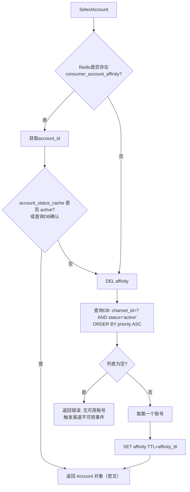
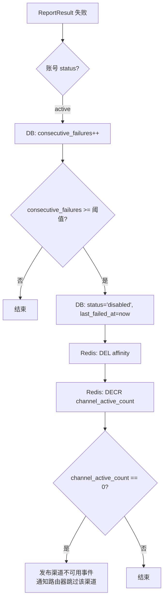
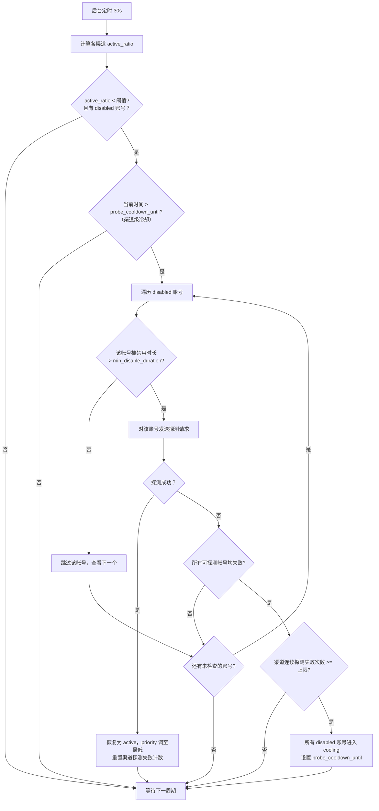

# 账号池核心逻辑详细设计（修订版，含冷却保护与全局加密）

## 1. 概述

账号池模块负责管理同一渠道下的多个上游账号（API Key），并在请求到达时，按优先级、粘性和健康状态选择一个最佳账号。同时，根据失败情况对账号进行自动禁用和按需探测恢复。

核心设计目标：

- **缓存友好**：同一消费者尽可能复用同一账号，利用上游语义/频率缓存。
    
- **高可用**：账号故障时自动降级，渠道不可用时快速失败转移。
    
- **资源保护**：避免无效探测，仅在资源紧张时尝试恢复；被禁用账号需等待最小冷却时间才允许探测，防止触发上游更严厉限流或封号。

## 2. 全局加密与环境变量

### 2.1 全局加密密钥

- 启动时自动生成或从 `.env` 的 `SECRET_KEY` 加载 32 字节随机密钥（Base64 编码）。
    
- 所有敏感数据（上游账号 Key、插件 Token 等）使用 AES-256-GCM 加解密。
    
- 加密工具包提供 `Encrypt(plaintext) ([]byte, error)` 和 `Decrypt(ciphertext) (string, error)` 接口。

### 2.2 .env 与 config.yaml 配置项

```yaml
# config.yaml（非敏感默认值）
account_manager:
  affinity_ttl: 3600                          # 绑定有效期(秒)
  consecutive_failure_threshold: 5            # 连续失败禁用阈值
  min_disable_duration: 120                   # 账号禁用后最小冷却时间(秒)
  probe_interval: 30                          # 按需探测周期(秒)
  probe_active_ratio_threshold: 0.4           # 触发探测的低水位线
  max_probe_failures: 10                      # 最大连续探测失败次数
  max_probe_recover_per_cycle: 1              # 每次探测周期最大恢复账号数
  probe_cooldown_duration: 7200               # 一级冷却时长(秒)
  probe_cooldown_duration_l2: 86400           # 二级冷却时长(秒)
  global_health_check_interval: 3600          # 全局健康巡检间隔(秒)
  account_status_cache_ttl: 30                # 状态缓存时间(秒)
  account_key_cache_ttl: 60                   # Key解密缓存(秒)
```

```bash
# .env（可覆盖 config.yaml）
SECRET_KEY=base64encodedkey...
ACCOUNT_AFFINITY_TTL=3600
ACCOUNT_FAILURE_THRESHOLD=5
ACCOUNT_MIN_DISABLE_DURATION=120
ACCOUNT_PROBE_INTERVAL=30
ACCOUNT_PROBE_ACTIVE_RATIO=0.4
ACCOUNT_PROBE_MAX_FAILURES=10
ACCOUNT_PROBE_MAX_RECOVER_PER_CYCLE=1
ACCOUNT_PROBE_COOLDOWN=7200
ACCOUNT_PROBE_COOLDOWN_L2=86400
ACCOUNT_GLOBAL_HEALTH_CHECK_INTERVAL=3600
```

## 3. 数据结构

### 3.1 数据库表 (channel_accounts)

```sql
channel_accounts (
    id BIGINT PRIMARY KEY,
    channel_id INT NOT NULL,
    api_key_encrypted TEXT NOT NULL,   -- AES-256-GCM 密文（Base64）
    priority INT NOT NULL DEFAULT 0,   -- 越小越优先
    status ENUM('active','disabled','cooling') NOT NULL DEFAULT 'active',
    consecutive_failures INT NOT NULL DEFAULT 0,
    last_failed_at TIMESTAMP NULL,     -- 最近失败时间，用于计算禁用时长
    probe_cooldown_until TIMESTAMP NULL,
    created_at TIMESTAMP DEFAULT CURRENT_TIMESTAMP,
    INDEX idx_channel_status_priority (channel_id, status, priority)
);
```

- **api_key_encrypted**：存储密文，使用系统全局密钥加密。
    
- **last_failed_at**：账号最近一次被标记为 disabled 的时间。探测前用当前时间减去此值，若小于 `min_disable_duration` 则跳过该账号。
    
- 解密接口 `GetDecryptedAPIKey(ctx, accountID)` 负责提供明文，解密失败视为账号永久损坏。

### 3.2 Redis 键设计

|键名|类型|说明|
|---|---|---|
|`consumer_account_affinity:{consumer_id}:{channel_id}`|String|当前绑定的 account_id，TTL 默认 1 小时|
|`account_status_cache:{account_id}`|String|缓存账号状态，TTL 30 秒|
|`account_key_cache:{account_id}`|String|**可选**：缓存已解密 Key，TTL 60 秒|
|`channel_active_count:{channel_id}`|Int|当前 active 账号数量（原子操作维护）|
|`probe_lock:{channel_id}`|String (NX)|探测任务分布式锁，避免并发探测|

## 4. 账号选择与粘性流程

### 4.1 选择入口

```go
func (m *AccountManager) SelectAccount(ctx context.Context, consumerID, channelID uint) (*Account, error)
```

返回的 `Account` 对象仅包含密文，明文 Key 通过 `GetDecryptedAPIKey` 延迟获取。

### 4.2 选择流程



### 4.3 解密时机

代理引擎在构造 HTTP 请求头时调用：

```go
plainKey, err := accountManager.GetDecryptedAPIKey(ctx, account.ID)
if err != nil {
    // 解密失败，标记账号为 disabled，清除绑定，返回错误
    accountManager.ReportResult(ctx, account.ID, false, 0)
    return ErrAccountDecryptFailed
}
// 设置 Authorization: Bearer plainKey
```

解密逻辑可带缓存：`account_key_cache:{id}` 存解密结果 60 秒，减少计算开销。

## 5. 故障处理与降级

### 5.1 故障反馈接口

```go
func (m *AccountManager) ReportResult(ctx context.Context, accountID uint, success bool, statusCode int) error
```

- **失败判定**：HTTP 5xx / 429 / 网络超时。
    
- **4xx 非 429**：不计入账号失败。

### 5.2 降级流程



- 解密失败时直接走此禁用流程。
    
- `last_failed_at` 记录禁用时刻，用于后续探测的冷却检查。

## 6. 按需探测与恢复（含冷却保护）

### 6.1 探测调度器

一个独立 Goroutine，每隔 `probe_interval` 秒执行一次。

**伪代码**：

```go
for _, ch := range channels {
    activeCount := getActiveCount(ch.ID)
    totalCount := getTotalAccountCount(ch.ID)

    // 资源充足，不探测
    if activeCount / totalCount >= probeActiveRatioThreshold {
        continue
    }
    // 获取分布式锁
    if !acquireProbeLock(ch.ID) {
        continue
    }
    disabledAccs := getDisabledAccountsNotInChannelCooldown(ch.ID)
    if len(disabledAccs) == 0 {
        releaseProbeLock(ch.ID)
        continue
    }

    probedAny := false
    anySuccess := false
    for _, acc := range disabledAccs {
        // ========= 新增：冷却时间检查 =========
        disableDuration := time.Since(acc.LastFailedAt)
        if disableDuration < MinDisableDuration {
            // 该账号刚被禁用，跳过探测，避免触发上游更严厉限流
            continue
        }
        // =====================================
        probedAny = true
        plainKey, err := GetDecryptedAPIKey(ctx, acc.ID)
        if err != nil {
            acc.Status = "permanent_failure"
            db.Save(acc)
            continue
        }
        success := probeAccount(ch, acc, plainKey)
        if success {
            recoverAccount(acc)
            if ch.WasUnavailable && activeCount == 0 {
                publishChannelAvailable(ch.ID)
            }
            ch.probeFailCount = 0
            anySuccess = true
            recoveredCount++
            if recoveredCount >= maxProbeRecoverPerCycle {
                break  // 达到本轮恢复数量上限
            }
        } else {
            ch.probeFailCount++
        }
    }

    if probedAny && !anySuccess {
        // 所有可探测账号均失败
        if ch.probeFailCount >= maxProbeFailures {
            // 进入渠道级冷却
            setAccountsCooling(ch.ID, time.Now().Add(probeCooldownDuration))
            ch.probeFailCount = 0
        }
    }
    releaseProbeLock(ch.ID)
}
```

### 6.2 探测流程（更新版）



### 6.3 事件说明

- **跳过**：账号刚被禁用未满 `min_disable_duration`（如2分钟），不探测，保护上游资源。
    
- **渠道可用事件**：当恢复的账号数量使 `active_count` 从 0 变为 1 时，向 Router 发布渠道可用通知。
    
- **渠道不可用**：探测失败满 `max_probe_failures` 进入 cooling，同时渠道仍保持不可用状态（active=0），请求由路由自动切换。
    
- **特殊标识**：解密失败的账号直接标记为 `permanent_failure`，不再参与所有自动流程，需人工处理。
    

### 6.4 全局健康巡检（与按需探测互补）

除了按需探测，系统还运行一个独立的**全局健康巡检**协程，用于常规、稀疏的全量健康检查：

| 维度 | 按需探测 | 全局健康巡检 |
|------|----------|------------|
| 触发条件 | `active_ratio < 阈值` | 定时触发（可配置，建议 1-6 小时） |
| 检测范围 | 仅低可用渠道 | 所有渠道的所有 `disabled`/`cooling` 账号 |
| 频率 | 30 秒（仅在低可用时） | 可配置（如每 1 小时） |
| 限制 | `min_disable_duration` 冷却 | 同左，且每次每个渠道最多检测 1 个账号 |
| 用途 | 紧急恢复 | 例行巡检，及时发现恢复的账号，补充可用资源池 |

**巡检流程伪代码**：

```go
func globalHealthCheck() {
    for _, ch := range allChannels {
        // 只巡检有 disabled/cooling 账号且不在渠道级冷却期的渠道
        disabledAccs := getDisabledAccountsNotInCooldown(ch.ID)
        if len(disabledAccs) == 0 {
            continue
        }
        // 每个渠道每次最多检测 1 个账号
        acc := disabledAccs[0]
        if time.Since(acc.LastFailedAt) < MinDisableDuration {
            continue
        }
        plainKey, err := GetDecryptedAPIKey(ctx, acc.ID)
        if err != nil {
            continue
        }
        success := probeAccount(ch, acc, plainKey)
        if success {
            recoverAccount(acc)
        }
    }
}
```

全局巡检和按需探测共享同一套 `probe_lock` 分布式锁，避免并发探测冲突。

### 6.5 阶梯式冷却机制

当渠道探测持续失败时，冷却时长会逐级递增，防止反复无效探测触发上游更严厉的限流或封号：

| 冷却级别 | 触发条件 | 冷却时长 | 说明 |
|---------|---------|---------|------|
| 一级冷却 | 探测失败 ≥ `max_probe_failures`（10次） | `probe_cooldown_duration`（默认2小时） | 首次进入冷却 |
| 二级冷却 | 一级冷却结束后，再次探测失败 ≥ `max_probe_failures` | `probe_cooldown_duration_l2`（默认24小时） | 防止反复探测触发封号 |
| 重置条件 | 二级冷却结束后的首次探测，若有账号恢复成功 | 冷却计数器归零 | 恢复正常探测周期 |

**实现**：渠道级别新增 `consecutive_cooldown_cycles` 计数器。每进入一次冷却 `+1`，当 `≥2` 时使用 `probe_cooldown_duration_l2`。任一次探测成功恢复账号后，该计数器归零。

```go
func enterChannelCooldown(ch *Channel) {
    ch.consecutiveCooldownCycles++
    var cooldownDuration time.Duration
    if ch.consecutiveCooldownCycles >= 2 {
        cooldownDuration = probeCooldownDurationL2  // 24小时
    } else {
        cooldownDuration = probeCooldownDuration     // 2小时
    }
    until := time.Now().Add(cooldownDuration)
    setAccountsCooling(ch.ID, until)
}

func recoverAccount(acc *Account) {
    // ... 原有恢复逻辑 ...
    // 重置冷却计数器
    resetCooldownCycles(acc.ChannelID)
}
```
    

## 7. 账号恢复处理

```go
func recoverAccount(acc *Account) {
    acc.Status = "active"
    acc.ConsecutiveFailures = 0
    acc.LastFailedAt = nil
    acc.ProbeCooldownUntil = nil
    // 优先级调整为当前渠道最大 priority + 1
    maxPriority := db.MaxPriority(acc.ChannelID)
    acc.Priority = maxPriority + 1
    db.Save(acc)
    redis.Incr("channel_active_count:" + ch.ID)
    redis.Del("account_status_cache:" + acc.ID)
}
```

## 8. 渠道冷却处理

```go
func setAccountsCooling(channelID uint, until time.Time) {
    db.Model(&Account{}).Where("channel_id = ? AND status = 'disabled'", channelID).
        Updates(map[string]interface{}{
            "status": "cooling",
            "probe_cooldown_until": until,
        })
    // 清除相关缓存
    redisDelKeysByPattern("account_status_cache:*")
    // 重置渠道探测失败计数
    resetProbeFailCount(channelID)
}
```

## 9. 缓存与安全

- **Key 解密缓存**：`account_key_cache:{id}` 最多存活 60 秒，明文不落硬盘。
    
- **SECRET_KEY 保护**：`.env` 不提交 Git，Docker 环境变量注入，程序日志禁止输出密钥。
    
- **加密算法**：AES-256-GCM，带有随机 Nonce，抵御重放。
    
- **日志脱敏**：日志中仅记录账号 ID 和脱敏标识（如 `sk-...****`），不输出完整明文 Key。

## 10. 管理接口 (WebUI)

- 创建/编辑账号时，前端传输明文 Key（通过 HTTPS），后端接收后即加密存储，不保留明文痕迹。
    
- 账号列表仅显示密文脱敏版本（如 `sk-...****`，不暴露任何真实字符）。管理员可通过 SHA256 前 8 位指纹区分不同账号。
    
- 拖动调整优先级直接修改 `priority` 字段，并清除关联的 Redis 绑定，让新请求获取新优先级。
    
- 手动禁用/启用：管理员可手动将账号停用或恢复，手动恢复时重置失败计数器。
    

## 11. 配置汇总

```yaml
account_manager:
  affinity_ttl: 3600                          # 绑定有效期(秒)
  consecutive_failure_threshold: 5            # 连续失败禁用阈值
  min_disable_duration: 120                   # 账号禁用后最小冷却时间(秒)，防止短时内重复探测触发上游封号
  probe_interval: 30                          # 按需探测周期(秒)
  probe_active_ratio_threshold: 0.4           # 触发探测的低水位线
  max_probe_failures: 10                      # 最大连续探测失败次数（进入渠道级冷却前的上限）
  max_probe_recover_per_cycle: 1              # 每次探测周期最大恢复账号数（默认1）
  probe_cooldown_duration: 7200               # 一级冷却时长(秒)，默认2小时
  probe_cooldown_duration_l2: 86400           # 二级冷却时长(秒)，默认24小时
  global_health_check_interval: 3600          # 全局健康巡检间隔(秒)，默认1小时
  account_status_cache_ttl: 30                # 状态缓存时间(秒)
  account_key_cache_ttl: 60                   # Key解密缓存(秒)
```


---

本设计融合了全局加密密钥、环境变量配置、完整的账号选择、故障转移，以及新增的最小冷却时间保护与双重冷却机制，可直接用于开发实现。