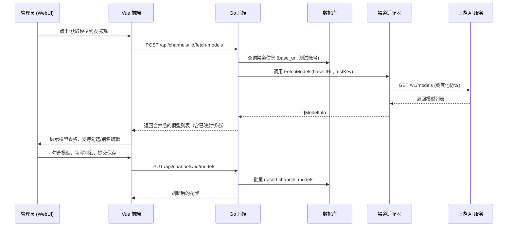

# 模型自动发现与映射流程详细设计（修订版）

## 1. 概述

为了方便管理员配置渠道，系统提供了模型自动发现功能。通过调用渠道适配器的 `FetchModels()` 接口，自动获取上游 AI 服务商支持的所有模型列表。管理员可以在 WebUI 中勾选需要的模型，并自定义对外暴露的显示名称（即模型映射），从而实现：

- 一键拉取替代手工录入，减少出错的概率。
    
- 不同渠道的同一模型可映射为统一别名，简化下游调用。
    
- 未勾选的模型不会对外暴露，确保安全性。

## 2. 整体流程



## 3. 适配器接口扩展

### 3.1 模型信息结构体

```go
type ModelInfo struct {
    ID       string `json:"id"`       // 上游原始模型名，如 "gpt-4o"
    Display  string `json:"display"`  // 上游推荐名称，如 "GPT-4o"
    OwnedBy  string `json:"owned_by"` // 归属方，如 "openai"
}
```

### 3.2 FetchModels 接口

位于每个渠道适配器实现：

```go
func (a *OpenAIAdapter) FetchModels(baseURL, apiKey string) ([]ModelInfo, error) {
    client := &http.Client{Timeout: 10 * time.Second}
    req, _ := http.NewRequest("GET", baseURL+"/v1/models", nil)
    req.Header.Set("Authorization", "Bearer "+apiKey)
    resp, err := client.Do(req)
    if err != nil { return nil, err }
    defer resp.Body.Close()
    // 解析 OpenAI 返回格式
    var result struct {
        Data []struct {
            ID      string `json:"id"`
            OwnedBy string `json:"owned_by"`
        } `json:"data"`
    }
    json.NewDecoder(resp.Body).Decode(&result)
    var models []ModelInfo
    for _, m := range result.Data {
        models = append(models, ModelInfo{ID: m.ID, OwnedBy: m.OwnedBy, Display: m.ID})
    }
    return models, nil
}
```

其他渠道（Claude、Gemini 等）各自实现相应解析逻辑。若某渠道不支持模型列表接口（如自定义代理），`FetchModels` 可返回 `ErrNotSupported`，后端将提示管理员手动添加。

## 4. API 设计

### 4.1 获取可配置模型列表

`POST /api/channels/:id/fetch-models`  
请求体：

json

{
  "test_key": "sk-xxx"   // 可选，若不填则使用渠道下第一个 active 账号解密后的 Key
}

响应体：

```json
{
  "models": [
    {
      "upstream_id": "gpt-4o",
      "display_name": "",
      "already_configured": false,
      "existing_display_name": "",
      "enabled": true
    },
    {
      "upstream_id": "gpt-4o-mini",
      "display_name": "my-fast-model",
      "already_configured": true,
      "existing_display_name": "my-fast-model",
      "enabled": true
    }
  ]
}
```

- `display_name`：管理员自定义别名（空字符串表示未设置）。
    
- `already_configured`：该上游模型是否已在 `channel_models` 表中存在。
    
- `enabled`：默认为 `true`，若之前配置过且管理员取消勾选，则为 `false`（可通过状态字段实现）。  
    后端逻辑：
    

1. 如果请求未提供 `test_key`，则从渠道的 `active` 账号中选择一个优先级最高的，调用 `GetDecryptedAPIKey` 获得明文 Key。
    
2. 调用适配器的 `FetchModels`。
    
3. 查询该渠道已有 `channel_models`（包括已禁用），做合并对比。
    
4. 返回前端。

### 4.2 保存映射配置

`PUT /api/channels/:id/models`  
请求体：

```json
{
  "models": [
    { "upstream_id": "gpt-4o", "enabled": true, "display_name": "" },
    { "upstream_id": "gpt-4o-mini", "enabled": true, "display_name": "my-fast-model" }
  ]
}
```

后端逻辑：

- 开启事务，对 `channel_models` 表进行 Upsert 操作（基于 `channel_id + upstream_model_name` 唯一键）。
    
- 若 `enabled=false`，则将对应记录的 `status` 字段更新为 `disabled`，路由时忽略。
    
- 校验 `display_name` 在该渠道下唯一（可选，全局唯一视需求而定）。
    
- 返回成功。

## 5. 模型映射与路由协作

### 5.1 映射的生效点

`group_router` 在检查“模型是否存在”时，查询条件为：

```sql
SELECT 1 FROM channel_models
WHERE channel_id = ? AND display_model_name = ? AND status = 'enabled'
```

- 若管理员未设置 `display_name`（即为空），则 `display_model_name` 在表中存储为 `upstream_model_name`。
    
- 请求中的 `model` 字段与 `display_model_name` 匹配即可路由到该渠道。

### 5.2 同名模型跨渠道（修订）

当多个渠道的模型映射为相同 `display_model_name` 时（如渠道A和B都映射为“gpt-4”），路由的分组选择器会按照既定的**分层确定性策略**处理：

1. **渠道权重优先**：在分组内，所有包含该模型别名的渠道会按照其在分组内的权重降序排列。
    
2. **账号优先级与可用性**：从权重最高的渠道开始，检查该渠道是否有 `active` 账号，若有，则调用账号池选择最佳账号（粘性优先，否则按 `priority ASC`）。若无，则跳过。
    
3. **确定性与容错**：若权重相同，则按渠道 ID 升序确定顺序（可预测）。整个选择过程不包含随机因素，保证相同请求始终命中同一路径。
    
4. **故障转移**：若所选渠道或账号不可用，自动按权重顺序降级到下一渠道，记录 `retry_chain`。

这样，模型别名在分组内多个渠道间实现了基于权重的负载分担和有序故障转移，完全可预测。

### 5.3 动态检测与通知

- 定时任务（可选，每日一次）可调用各渠道 `FetchModels`，与数据库比对，发现上游已下线的模型自动标记为 `disabled` 并通知管理员。
    
- 下架模型保存在表内，管理员可手动删除或重新启用。

## 6. WebUI 交互设计

- **触发按钮**：渠道详情页 → “模型配置”卡片 → “获取模型列表”按钮（带加载状态）。
    
- **批量操作**：全选、反选、按前缀筛选。
    
- **内联编辑**：表格内直接编辑别名，支持实时保存或批量保存。
    
- **错误提示**：若 `FetchModels` 失败，显示具体错误（如 401 账号无效、404 不支持接口），引导管理员检查。